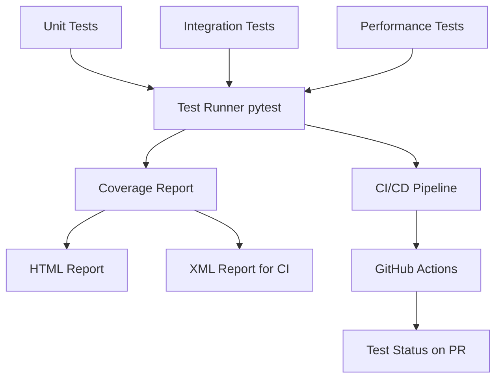
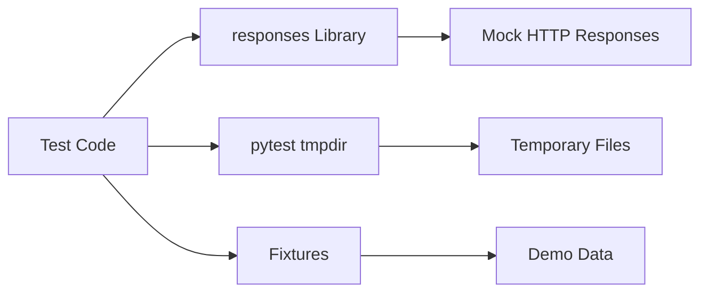
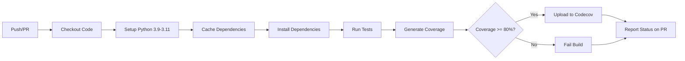

# Technical Design Document: Testing & Quality Assurance

## Overview

This document outlines the technical design for implementing a comprehensive testing infrastructure for the AnyRun Malware Incident Response Tool. The system currently lacks automated testing, making it difficult to ensure code quality and detect regressions during feature development.

The testing infrastructure will use pytest as the primary testing framework, with pytest-cov for coverage reporting, responses library for HTTP mocking, and pytest-benchmark for performance testing. The goal is to achieve 80%+ overall code coverage with a mix of unit tests, integration tests, and performance benchmarks.

### Scope

**In Scope:**
- Unit tests for all core modules (anyrun_client, analyzer, incident_response, reporter, ml_engine)
- Integration tests for Flask API endpoints and CLI commands
- Test fixtures and demo data management
- Code coverage measurement and reporting
- CI/CD integration with GitHub Actions
- Mock strategies for external dependencies (API calls, file I/O)
- Performance benchmarks for critical operations
- Test documentation and guidelines

**Out of Scope:**
- End-to-end tests with real Any.Run API (requires paid API key)
- UI/frontend testing (JavaScript tests for static/app.js)
- Load testing and stress testing
- Security penetration testing
- Manual QA processes

### Key Design Decisions

1. **pytest over unittest**: pytest provides better fixture management, parametrization, and plugin ecosystem
2. **responses library for HTTP mocking**: Cleaner API than unittest.mock for HTTP requests
3. **Separate test fixtures in conftest.py**: Promotes reusability and reduces test code duplication
4. **Mirror source structure in tests/**: Makes it easy to locate tests for specific modules
5. **Minimum 80% overall coverage**: Balances thoroughness with development velocity
6. **GitHub Actions for CI**: Free for public repos, good Python support

## Architecture

### Test Directory Structure

```
tests/
├── conftest.py                 # Shared fixtures and pytest configuration
├── fixtures/                   # Static test data files
│   ├── emotet_report.json
│   ├── wannacry_report.json
│   ├── redline_report.json
│   ├── emotet_ioc.json
│   ├── wannacry_ioc.json
│   └── redline_ioc.json
├── unit/                       # Unit tests (isolated, fast)
│   ├── test_anyrun_client.py
│   ├── test_analyzer.py
│   ├── test_incident_response.py
│   ├── test_reporter.py
│   └── test_ml_engine.py
├── integration/                # Integration tests (multiple components)
│   ├── test_flask_api.py
│   ├── test_cli.py
│   └── test_end_to_end.py
├── performance/                # Performance benchmarks
│   ├── test_analyzer_benchmark.py
│   └── test_reporter_benchmark.py
└── README.md                   # Test documentation
```

### Test Layers



### Mock Strategy



## Components and Interfaces

### 1. Test Configuration (pytest.ini)

**Purpose**: Configure pytest behavior, test discovery, and coverage settings

**Configuration:**
```ini
[pytest]
testpaths = tests
python_files = test_*.py *_test.py
python_classes = Test*
python_functions = test_*
addopts = 
    --verbose
    --strict-markers
    --cov=.
    --cov-report=html
    --cov-report=term-missing
    --cov-report=xml
    --cov-fail-under=80
markers =
    unit: Unit tests (fast, isolated)
    integration: Integration tests (slower, multiple components)
    performance: Performance benchmarks
    slow: Tests that take >1 second
```

### 2. Shared Fixtures (conftest.py)

**Purpose**: Provide reusable test fixtures across all test files

**Key Fixtures:**

```python
@pytest.fixture
def emotet_report() -> dict:
    """Load Emotet demo report JSON"""
    
@pytest.fixture
def wannacry_report() -> dict:
    """Load WannaCry demo report JSON"""
    
@pytest.fixture
def redline_report() -> dict:
    """Load RedLine demo report JSON"""
    
@pytest.fixture
def mock_anyrun_client():
    """Provide AnyRunClient with mocked HTTP responses"""
    
@pytest.fixture
def temp_output_dir(tmp_path):
    """Provide temporary directory for file output tests"""
    
@pytest.fixture
def flask_test_client():
    """Provide Flask test client for API testing"""
    
@pytest.fixture
def sample_analysis_result() -> MalwareAnalysisResult:
    """Provide sample MalwareAnalysisResult object"""
    
@pytest.fixture
def sample_playbook() -> IncidentResponsePlaybook:
    """Provide sample IncidentResponsePlaybook object"""
```

### 3. Unit Test Modules

#### 3.1 test_anyrun_client.py

**Purpose**: Test AnyRunClient API wrapper with mocked HTTP responses

**Test Classes:**
- `TestAnyRunClientInit`: Test client initialization and validation
- `TestAnyRunClientGetMethods`: Test GET endpoints (get_task_report, get_task_iocs, get_history)
- `TestAnyRunClientPostMethods`: Test POST endpoints (submit_url, submit_file)
- `TestAnyRunClientErrorHandling`: Test error responses (401, 404, 429, connection errors)

**Key Test Patterns:**
```python
@responses.activate
def test_get_task_report_success(mock_anyrun_client, emotet_report):
    responses.add(
        responses.GET,
        "https://api.any.run/v1/report/test-uuid/summary/json",
        json=emotet_report,
        status=200
    )
    result = mock_anyrun_client.get_task_report("test-uuid")
    assert result == emotet_report
```

**Coverage Target**: 85%

#### 3.2 test_analyzer.py

**Purpose**: Test MalwareAnalyzer parsing logic with multiple malware families

**Test Classes:**
- `TestMalwareAnalyzerParsing`: Test parse_report() with different malware families
- `TestFamilyDetection`: Test _detect_malware_family() heuristics
- `TestNetworkParsing`: Test _parse_network() with various network data
- `TestProcessParsing`: Test _parse_processes() with injection and dropped files
- `TestIOCParsing`: Test _parse_iocs() with different IOC formats

**Parametrized Tests:**
```python
@pytest.mark.parametrize("fixture_name,expected_family", [
    ("emotet_report", "Emotet"),
    ("wannacry_report", "WannaCry"),
    ("redline_report", "RedLine Stealer"),
])
def test_malware_family_detection(fixture_name, expected_family, request):
    report = request.getfixturevalue(fixture_name)
    # Test family detection logic
```

**Coverage Target**: 80%

#### 3.3 test_incident_response.py

**Purpose**: Test IncidentResponseGenerator playbook generation logic

**Test Classes:**
- `TestPlaybookGeneration`: Test generate() with different threat levels
- `TestNISTPhases`: Test all NIST IR phases are included
- `TestMITREActions`: Test MITRE ATT&CK specific actions (T1486, T1566, T1055, etc.)
- `TestIOCBlocklist`: Test IOC blocklist generation
- `TestSeverityMapping`: Test threat_level to severity mapping

**Coverage Target**: 75%

#### 3.4 test_reporter.py

**Purpose**: Test ReportExporter output formatting

**Test Classes:**
- `TestMarkdownExport`: Test Markdown report generation
- `TestJSONExport`: Test JSON report generation and round-trip
- `TestReportContent`: Test required sections are present
- `TestFileCreation`: Test file I/O with temporary directories

**Coverage Target**: 70%

#### 3.5 test_ml_engine.py

**Purpose**: Test MLThreatPredictor feature extraction and prediction

**Test Classes:**
- `TestMLInitialization`: Test initialization with/without model file
- `TestFeatureExtraction`: Test extract_features() with various analysis results
- `TestFeatureShape`: Test feature vector dimensions
- `TestPrediction`: Test predict() with mocked model
- `TestPredictionValidation`: Test prediction output validation

**Coverage Target**: 80%

### 4. Integration Test Modules

#### 4.1 test_flask_api.py

**Purpose**: Test Flask API endpoints with Flask test client

**Test Classes:**
- `TestDemoEndpoints`: Test /api/demo/* endpoints
- `TestAnalyzeEndpoint`: Test /api/analyze/json with file uploads
- `TestExportEndpoint`: Test /api/export with different formats
- `TestHistoryEndpoint`: Test /api/history/local
- `TestErrorHandling`: Test 400/500 error responses

**Setup:**
```python
@pytest.fixture
def client(flask_test_client):
    return flask_test_client

def test_demo_emotet(client):
    response = client.get('/api/demo/emotet')
    assert response.status_code == 200
    data = response.get_json()
    assert 'threat_info' in data
    assert data['threat_info']['threat_name'] == 'Emotet'
```

#### 4.2 test_cli.py

**Purpose**: Test main.py CLI commands

**Test Approach**: Use subprocess to run CLI commands

**Test Cases:**
- Test `--demo` flag
- Test `--demo --no-export` flag
- Test `--report-json` with valid file
- Test `--report-json` with invalid file
- Test output file creation

**Example:**
```python
def test_demo_mode(temp_output_dir):
    result = subprocess.run(
        ['python', 'main.py', '--demo'],
        capture_output=True,
        text=True,
        timeout=30
    )
    assert result.returncode == 0
    assert 'Analysis complete' in result.stdout
```

### 5. Performance Test Modules

#### 5.1 test_analyzer_benchmark.py

**Purpose**: Benchmark analyzer parsing performance

**Benchmarks:**
- `test_parse_small_report`: Test with <100KB report
- `test_parse_large_report`: Test with >1MB report (should complete <2s)
- `test_parse_complex_mitre`: Test with many MITRE techniques

**Example:**
```python
def test_parse_large_report_performance(benchmark, large_report):
    analyzer = MalwareAnalyzer()
    result = benchmark(analyzer.parse_report, large_report, {})
    assert benchmark.stats['mean'] < 2.0  # Must complete within 2 seconds
```

#### 5.2 test_reporter_benchmark.py

**Purpose**: Benchmark report export performance

**Benchmarks:**
- `test_markdown_export_performance`: Should complete <1s
- `test_json_export_performance`: Should complete <500ms
- `test_playbook_generation_performance`: Should complete <500ms

## Correctness Properties

### Why Property-Based Testing Does Not Apply

This feature is about building a **test infrastructure** to test existing application code, not implementing new business logic. Property-based testing (PBT) is not appropriate for this feature because:

1. **Meta-Level Testing**: We are building tests that test other code. The "correctness properties" would be circular: "tests should correctly test the code."

2. **Infrastructure Configuration**: Most requirements are about test infrastructure setup (SMOKE tests):
   - Directory structure exists
   - Configuration files are present
   - Dependencies are installed
   - Fixtures are available

3. **Integration Testing**: Many requirements test external systems (Flask API, CLI, CI/CD pipeline) where behavior is deterministic and doesn't benefit from randomized input generation.

4. **Example-Based Nature**: The core testing requirements are example-based:
   - Test Emotet detection with Emotet fixture
   - Test WannaCry detection with WannaCry fixture
   - Test API error handling with specific HTTP status codes

5. **Coverage Metrics**: Several requirements are about achieving coverage thresholds, which are metrics, not testable behaviors.

### Testing Strategy for This Feature

Instead of property-based tests, this feature uses:

- **Example-based unit tests**: Test specific scenarios with known inputs/outputs
- **Parametrized tests**: Test multiple similar scenarios efficiently
- **Integration tests**: Test component interactions and external systems
- **Smoke tests**: Verify infrastructure setup and configuration
- **Performance benchmarks**: Measure execution time for critical operations

The test suite we're building WILL use property-based testing for the APPLICATION code (e.g., testing that analyzer parsing works for any valid report structure), but the test infrastructure itself is not amenable to PBT.

### Properties for Application Code Under Test

While the test infrastructure itself doesn't have testable properties, the APPLICATION code being tested does have properties that our test suite will verify. These properties represent the correctness guarantees of the malware analysis system:

### Property 1: Network IOC Deduplication

*For any* malware analysis report containing network activity, the parsed result SHALL contain no duplicate IP addresses, domains, or URLs in the respective lists.

**Validates: Requirements 3.5**

**Test Strategy**: Generate reports with intentionally duplicated network IOCs, verify the analyzer's deduplication logic removes all duplicates while preserving unique entries.

### Property 2: MITRE Technique Extraction Completeness

*For any* malware analysis report containing MITRE ATT&CK techniques, the parsed result SHALL extract all technique IDs present in the report without loss.

**Validates: Requirements 3.4**

**Test Strategy**: Generate reports with varying numbers of MITRE techniques (0, 1, 5, 20), verify all technique IDs are present in the parsed result.

### Property 3: NIST Phase Completeness

*For any* malware analysis result, the generated incident response playbook SHALL include actions from all five NIST IR phases (Identify, Contain, Eradicate, Recover, Lessons Learned).

**Validates: Requirements 4.2**

**Test Strategy**: Generate analysis results with varying threat levels and IOC types, verify all generated playbooks contain at least one action from each NIST phase.

### Property 4: Severity Mapping Consistency

*For any* malware analysis result with threat_level >= 2, the generated incident response playbook SHALL have severity set to "HIGH" or "CRITICAL".

**Validates: Requirements 4.1**

**Test Strategy**: Generate analysis results with threat_levels 2, 3, and 4, verify severity is never "LOW" or "MEDIUM".

### Property 5: IOC Blocklist Completeness

*For any* malware analysis result, the generated incident response playbook's IOC blocklist SHALL contain all unique IP addresses, domains, and file hashes from the analysis result.

**Validates: Requirements 4.9**

**Test Strategy**: Generate analysis results with known IOC counts, verify the blocklist contains exactly those IOCs without duplicates or omissions.

### Property 6: Network Isolation Action Generation

*For any* malware analysis result containing network IOCs (IPs or domains), the generated incident response playbook SHALL include at least one network isolation action with firewall commands.

**Validates: Requirements 4.3**

**Test Strategy**: Generate analysis results with varying numbers of network IOCs, verify playbook contains network isolation actions.

### Property 7: Process Termination Action Generation

*For any* malware analysis result containing injected processes, the generated incident response playbook SHALL include process termination actions for those processes.

**Validates: Requirements 4.4**

**Test Strategy**: Generate analysis results with injected process lists, verify playbook contains termination actions for each process.

### Property 8: Registry Cleanup Action Generation

*For any* malware analysis result containing persistence registry keys, the generated incident response playbook SHALL include registry cleanup actions.

**Validates: Requirements 4.8**

**Test Strategy**: Generate analysis results with registry keys, verify playbook contains cleanup actions.

### Property 9: Markdown Export Completeness

*For any* incident response playbook, the exported Markdown report SHALL contain the malware name, severity level, and all MITRE techniques in a structured format.

**Validates: Requirements 5.2**

**Test Strategy**: Generate playbooks with varying content, export to Markdown, verify all required sections are present.

### Property 10: JSON Export Round-Trip

*For any* incident response playbook, exporting to JSON and parsing back SHALL preserve all required fields (task_uuid, severity, actions, ioc_blocklist).

**Validates: Requirements 5.4, 5.5**

**Test Strategy**: Generate playbooks, export to JSON, parse back, verify all required fields match original values.

### Property 11: Feature Vector Shape Consistency

*For any* malware analysis result, the ML feature extraction SHALL produce a feature vector with shape (1, 11).

**Validates: Requirements 6.2**

**Test Strategy**: Generate analysis results with varying content, verify extracted feature vector always has correct dimensions.

### Property 12: Feature Value Validity

*For any* malware analysis result, the extracted ML features SHALL have network counts (num_ips, num_domains, num_http) >= 0 and MITRE tactic features (has_persistence, has_c2, has_impact) in {0, 1}.

**Validates: Requirements 6.3, 6.4**

**Test Strategy**: Generate analysis results, verify all feature values are in valid ranges.

### Property 13: ML Prediction Label Validity

*For any* malware analysis result processed by MLThreatPredictor with a loaded model, the prediction label SHALL be one of ["Clean", "Suspicious", "Malicious"].

**Validates: Requirements 6.6**

**Test Strategy**: Generate predictions with mocked model, verify label is always one of the three valid values.

### Property 14: ML Confidence Score Range

*For any* malware analysis result processed by MLThreatPredictor with a loaded model, the confidence score SHALL be between 0 and 100 inclusive.

**Validates: Requirements 6.7**

**Test Strategy**: Generate predictions with mocked model, verify 0 <= confidence <= 100.

### Property 15: Dropped File Extraction

*For any* malware analysis report containing dropped files, the parsed result SHALL extract all file hashes and names without loss.

**Validates: Requirements 3.7**

**Test Strategy**: Generate reports with varying numbers of dropped files, verify all are extracted correctly.

### Property 16: Process Injection Detection

*For any* malware analysis report containing processes marked as injected, the parsed result SHALL include all injected process names in the injected_processes list.

**Validates: Requirements 3.6**

**Test Strategy**: Generate reports with processes having isInjected=true, verify all are captured in the result.

## Data Models

### Test Fixture Data Structure

```python
# Emotet fixture structure
{
    "data": {
        "analysis": {
            "uuid": "test-uuid-emotet",
            "duration": 120,
            "tags": ["emotet", "trojan"],
            "options": {"os": {"version": "Windows 10 x64"}}
        },
        "content": {
            "mainObject": {
                "filename": "invoice.doc",
                "size": 524288,
                "hashes": {
                    "md5": "abc123...",
                    "sha1": "def456...",
                    "sha256": "ghi789..."
                }
            },
            "scores": {
                "verdict": {
                    "threatLevel": 3,
                    "threat": "Malicious"
                },
                "specs": {
                    "knownThreat": "Emotet"
                }
            },
            "mitre": [
                {"id": "T1566.001", "name": "Spearphishing Attachment", "tactic": "Initial Access"}
            ],
            "network": {
                "connections": [{"ip": "192.0.2.1"}],
                "httpRequests": [{"url": "http://evil.com", "domain": "evil.com"}],
                "dnsRequests": [{"domain": "evil.com"}]
            },
            "processes": [
                {"pid": 1234, "name": "winword.exe", "isInjected": true}
            ],
            "dropped": [
                {"filename": "payload.exe", "hashes": {"sha256": "xyz..."}}
            ]
        }
    }
}
```

### Mock Response Patterns

```python
# Success response pattern
{
    "status": "success",
    "data": { ... }
}

# Error response pattern
{
    "status": "error",
    "message": "Error description",
    "code": "ERROR_CODE"
}
```

## Testing Strategy

### Test Types and Distribution

| Test Type | Percentage | Purpose | Speed |
|-----------|-----------|---------|-------|
| Unit Tests | 70% | Test individual functions/classes in isolation | Fast (<1s total) |
| Integration Tests | 25% | Test component interactions | Medium (1-5s total) |
| Performance Tests | 5% | Benchmark critical operations | Slow (5-10s total) |

### Coverage Targets by Module

| Module | Target Coverage | Rationale |
|--------|----------------|-----------|
| anyrun_client.py | 85% | Critical API integration, many error paths |
| analyzer.py | 80% | Core parsing logic, complex branching |
| incident_response.py | 75% | Playbook generation, MITRE logic |
| reporter.py | 70% | Output formatting, less critical |
| ml_engine.py | 80% | Feature extraction, prediction logic |
| app.py | 60% | Flask routes, mostly integration tested |
| main.py | 50% | CLI entry point, integration tested |

### Test Execution Strategy

**Local Development:**
```bash
# Run all tests
pytest

# Run only unit tests (fast)
pytest -m unit

# Run with coverage
pytest --cov --cov-report=html

# Run specific module tests
pytest tests/unit/test_analyzer.py

# Run specific test
pytest tests/unit/test_analyzer.py::test_emotet_detection
```

**CI/CD Pipeline:**
```bash
# Run all tests with coverage and XML report
pytest --cov --cov-report=xml --cov-report=term-missing --cov-fail-under=80
```

### Mock Strategy Details

**HTTP Mocking (responses library):**
```python
import responses

@responses.activate
def test_api_call():
    responses.add(
        responses.GET,
        "https://api.any.run/v1/report/uuid/summary/json",
        json={"data": {...}},
        status=200
    )
    # Test code that makes HTTP request
```

**File I/O Mocking (pytest tmp_path):**
```python
def test_file_export(tmp_path):
    output_file = tmp_path / "report.md"
    exporter.export_markdown(playbook, output_file)
    assert output_file.exists()
    assert "# Incident Response" in output_file.read_text()
```

**ML Model Mocking:**
```python
@pytest.fixture
def mock_ml_model(monkeypatch):
    class MockModel:
        def predict(self, X):
            return ["Malicious"]
        def predict_proba(self, X):
            return [[0.1, 0.2, 0.7]]
    
    monkeypatch.setattr("ml_engine.joblib.load", lambda x: MockModel())
```

### Parametrized Testing

Use pytest.mark.parametrize for testing multiple scenarios:

```python
@pytest.mark.parametrize("threat_level,expected_severity", [
    (0, "LOW"),
    (1, "MEDIUM"),
    (2, "HIGH"),
    (3, "CRITICAL"),
    (4, "CRITICAL"),
])
def test_severity_mapping(threat_level, expected_severity):
    # Test severity mapping logic
```

### Test Isolation

**Principles:**
1. Each test should be independent (no shared state)
2. Use fixtures for setup/teardown
3. Clean up temporary files after tests
4. Reset mocks between tests

**Example:**
```python
@pytest.fixture(autouse=True)
def reset_state():
    # Setup
    yield
    # Teardown - clean up any global state
```

## Error Handling

### Error Scenarios to Test

1. **API Client Errors:**
   - Invalid API key (401)
   - Resource not found (404)
   - Rate limit exceeded (429)
   - Network connection failure
   - Malformed JSON response
   - Timeout errors

2. **Parsing Errors:**
   - Missing required fields in report
   - Unexpected data types
   - Empty/null values
   - Malformed JSON structure

3. **File I/O Errors:**
   - Permission denied
   - Disk full
   - Invalid file path
   - File already exists

4. **Validation Errors:**
   - Invalid UUID format
   - Empty file upload
   - Unsupported file format

### Error Testing Pattern

```python
def test_error_handling():
    with pytest.raises(ExpectedError) as exc_info:
        # Code that should raise error
        function_that_fails()
    
    assert "expected error message" in str(exc_info.value)
```

## CI/CD Pipeline

### GitHub Actions Workflow

**File**: `.github/workflows/tests.yml`

```yaml
name: Tests

on:
  push:
    branches: [ main, develop ]
  pull_request:
    branches: [ main, develop ]

jobs:
  test:
    runs-on: ubuntu-latest
    strategy:
      matrix:
        python-version: ['3.9', '3.10', '3.11']
    
    steps:
    - uses: actions/checkout@v3
    
    - name: Set up Python ${{ matrix.python-version }}
      uses: actions/setup-python@v4
      with:
        python-version: ${{ matrix.python-version }}
    
    - name: Cache dependencies
      uses: actions/cache@v3
      with:
        path: ~/.cache/pip
        key: ${{ runner.os }}-pip-${{ hashFiles('requirements.txt', 'requirements-dev.txt') }}
    
    - name: Install dependencies
      run: |
        python -m pip install --upgrade pip
        pip install -r requirements.txt
        pip install -r requirements-dev.txt
    
    - name: Run tests with coverage
      run: |
        pytest --cov --cov-report=xml --cov-report=term-missing --cov-fail-under=80
    
    - name: Upload coverage to Codecov
      uses: codecov/codecov-action@v3
      with:
        file: ./coverage.xml
        fail_ci_if_error: false
```

### CI Pipeline Stages



### Performance Considerations

**Target Execution Times:**
- Unit tests: <10 seconds total
- Integration tests: <30 seconds total
- Performance tests: <15 seconds total
- **Total CI run time: <2 minutes**

**Optimization Strategies:**
1. Use pytest-xdist for parallel test execution
2. Cache pip dependencies in CI
3. Skip slow tests in pre-commit hooks
4. Run performance tests only on main branch

## Dependencies

### Testing Dependencies (requirements-dev.txt)

```
# Core testing framework
pytest>=7.4.0
pytest-cov>=4.1.0
pytest-mock>=3.11.1
pytest-xdist>=3.3.1

# HTTP mocking
responses>=0.23.1

# Flask testing
pytest-flask>=1.2.0

# Performance testing
pytest-benchmark>=4.0.0

# Code quality
flake8>=6.0.0
black>=23.7.0
mypy>=1.4.1

# Coverage reporting
coverage[toml]>=7.2.7
```

### Test Data Dependencies

- Demo report JSON files (Emotet, WannaCry, RedLine)
- Demo IOC JSON files
- Sample malware hashes (for testing, not actual malware)
- Mock API response templates

## Implementation Plan

### Phase 1: Infrastructure Setup (Week 1)

1. Create tests/ directory structure
2. Set up pytest.ini configuration
3. Create requirements-dev.txt
4. Set up conftest.py with basic fixtures
5. Create demo data fixtures (JSON files)

### Phase 2: Unit Tests (Week 2-3)

1. Implement test_anyrun_client.py (85% coverage target)
2. Implement test_analyzer.py (80% coverage target)
3. Implement test_incident_response.py (75% coverage target)
4. Implement test_reporter.py (70% coverage target)
5. Implement test_ml_engine.py (80% coverage target)

### Phase 3: Integration Tests (Week 4)

1. Implement test_flask_api.py
2. Implement test_cli.py
3. Implement test_end_to_end.py
4. Verify overall coverage >= 80%

### Phase 4: Performance & CI/CD (Week 5)

1. Implement performance benchmarks
2. Set up GitHub Actions workflow
3. Configure Codecov integration
4. Write test documentation (tests/README.md)

### Phase 5: Documentation & Refinement (Week 6)

1. Complete test documentation
2. Add inline comments to complex tests
3. Create troubleshooting guide
4. Review and refactor tests for maintainability

## Validation and Acceptance

### Acceptance Criteria

1. ✅ All 15 requirements from requirements.md are addressed
2. ✅ Overall code coverage >= 80%
3. ✅ Module-specific coverage targets met
4. ✅ All tests pass on Python 3.9, 3.10, 3.11
5. ✅ CI/CD pipeline runs successfully
6. ✅ Test execution time < 2 minutes in CI
7. ✅ Test documentation complete
8. ✅ No real API calls in test suite

### Success Metrics

| Metric | Target | Measurement |
|--------|--------|-------------|
| Overall Coverage | >= 80% | pytest --cov |
| anyrun_client.py Coverage | >= 85% | pytest --cov |
| analyzer.py Coverage | >= 80% | pytest --cov |
| incident_response.py Coverage | >= 75% | pytest --cov |
| reporter.py Coverage | >= 70% | pytest --cov |
| ml_engine.py Coverage | >= 80% | pytest --cov |
| Test Execution Time (Local) | < 60s | pytest --durations=0 |
| Test Execution Time (CI) | < 120s | GitHub Actions logs |
| Test Count | >= 100 tests | pytest --collect-only |

### Validation Process

1. **Local Validation:**
   ```bash
   # Run all tests
   pytest -v
   
   # Check coverage
   pytest --cov --cov-report=html
   open htmlcov/index.html
   
   # Run performance tests
   pytest -m performance --benchmark-only
   ```

2. **CI Validation:**
   - Create PR with test implementation
   - Verify GitHub Actions passes
   - Review coverage report on Codecov
   - Verify all matrix builds (Python 3.9-3.11) pass

3. **Code Review:**
   - Review test quality and maintainability
   - Verify test names are descriptive
   - Check for proper use of fixtures
   - Ensure mocks are appropriate

## Maintenance and Evolution

### Adding New Tests

**Guidelines:**
1. Place unit tests in `tests/unit/`
2. Place integration tests in `tests/integration/`
3. Use descriptive test names: `test_<function>_<scenario>_<expected_result>`
4. Add docstrings to complex tests
5. Use fixtures from conftest.py when possible
6. Mark slow tests with `@pytest.mark.slow`

**Example:**
```python
def test_analyzer_parses_emotet_report_correctly(emotet_report):
    """
    Test that MalwareAnalyzer correctly identifies Emotet malware
    from a demo report and extracts all relevant IOCs.
    """
    analyzer = MalwareAnalyzer()
    result = analyzer.parse_report(emotet_report, {})
    
    assert result.threat_info.threat_name == "Emotet"
    assert result.threat_info.threat_level >= 2
    assert len(result.network.ip_addresses) > 0
```

### Updating Fixtures

When demo data changes:
1. Update JSON files in `tests/fixtures/`
2. Run tests to verify no breakage
3. Update fixture documentation in conftest.py

### Performance Regression Detection

Use pytest-benchmark to track performance:
```bash
# Save baseline
pytest --benchmark-save=baseline

# Compare against baseline
pytest --benchmark-compare=baseline
```

### Test Refactoring

**When to refactor:**
- Test becomes too long (>50 lines)
- Duplicate setup code across tests
- Test is flaky or hard to understand
- Coverage gaps identified

**Refactoring strategies:**
- Extract common setup to fixtures
- Use parametrize for similar test cases
- Split large test classes into smaller ones
- Add helper functions for complex assertions

## Appendix

### Useful pytest Commands

```bash
# Run tests with verbose output
pytest -v

# Run tests in parallel (faster)
pytest -n auto

# Run only failed tests from last run
pytest --lf

# Run tests matching pattern
pytest -k "test_analyzer"

# Show test durations
pytest --durations=10

# Run with coverage and open HTML report
pytest --cov --cov-report=html && open htmlcov/index.html

# Run specific markers
pytest -m "unit and not slow"

# Debug test failures
pytest --pdb  # Drop into debugger on failure
pytest -s     # Show print statements
```

### Common Test Patterns

**Testing Exceptions:**
```python
def test_invalid_api_key_raises_error():
    with pytest.raises(AnyRunAuthError, match="API key không hợp lệ"):
        AnyRunClient(api_key="invalid")
```

**Testing File Creation:**
```python
def test_export_creates_file(tmp_path):
    output = tmp_path / "report.md"
    exporter.export(playbook, output)
    assert output.exists()
    assert output.stat().st_size > 0
```

**Testing JSON Round-Trip:**
```python
def test_json_serialization_roundtrip(sample_playbook):
    json_str = json.dumps(sample_playbook, default=str)
    parsed = json.loads(json_str)
    assert parsed['malware_name'] == sample_playbook.malware_name
```

### Troubleshooting Guide

**Problem: Tests fail with "ModuleNotFoundError"**
- Solution: Ensure PYTHONPATH includes project root or install package in editable mode: `pip install -e .`

**Problem: Coverage report shows 0% coverage**
- Solution: Check that source files are in the coverage path. Update pytest.ini `--cov` option.

**Problem: Tests are slow**
- Solution: Use `pytest --durations=10` to find slow tests. Consider marking them with `@pytest.mark.slow` and skipping in development.

**Problem: Flaky tests (pass/fail randomly)**
- Solution: Check for shared state between tests. Ensure proper fixture cleanup. Use `pytest-repeat` to reproduce: `pytest --count=10`

**Problem: Mock not working**
- Solution: Verify mock is applied before function call. Check import paths. Use `monkeypatch` for better isolation.

### References

- [pytest documentation](https://docs.pytest.org/)
- [pytest-cov documentation](https://pytest-cov.readthedocs.io/)
- [responses library](https://github.com/getsentry/responses)
- [pytest-benchmark](https://pytest-benchmark.readthedocs.io/)
- [GitHub Actions Python guide](https://docs.github.com/en/actions/automating-builds-and-tests/building-and-testing-python)
