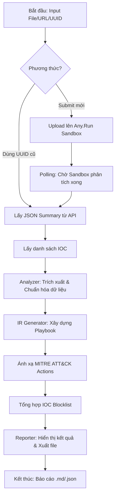

# Báo Cáo Chi Tiết Hệ Thống: Any.Run Malware Incident Response Tool

## 1. Giới thiệu tổng quan
**Any.Run Malware IR Tool** là một ứng dụng tự động hóa quy trình phân tích mã độc và xây dựng kịch bản phản ứng sự cố (Incident Response Playbook). Ứng dụng kết hợp sức mạnh của Sandbox Any.Run với các khung tiêu chuẩn quốc tế như **NIST SP 800-61** và **MITRE ATT&CK** để cung cấp các hành động ứng cứu cụ thể, chính xác cho điều tra viên.

## 2. Các tính năng chính
- **Phân tích đa nguồn:** Hỗ trợ phân tích qua File mẫu, URL nghi ngờ hoặc Task UUID đã có sẵn trên Any.Run.
- **Tự động hóa Playbook:** Tự động tạo kịch bản ứng cứu theo 5 giai đoạn NIST (Identification, Containment, Eradication, Recovery, Lessons Learned).
- **Trích xuất IOC thông minh:** Tổng hợp IP C2, Domain, URL và File Hash để nạp vào hệ thống phòng thủ (Firewall, EDR, SIEM).
- **Ánh xạ MITRE ATT&CK:** Nhận diện các kỹ thuật tấn công và đưa ra khuyến nghị xử lý tương ứng (ví dụ: Process Injection, Phishing, Ransomware).
- **Giao diện linh hoạt:** Cung cấp cả giao diện dòng lệnh (CLI) mạnh mẽ và giao diện Web (GUI) hiện đại.
- **Xuất báo cáo:** Hỗ trợ xuất dữ liệu ra định dạng Markdown (để lưu trữ/trình bày) và JSON (để tích hợp hệ thống).

## 3. Kiến trúc hệ thống
Hệ thống được thiết kế theo dạng module hóa:

1.  **`anyrun_client.py` (API Wrapper):** Quản lý kết nối, xác thực và giao tiếp với Any.Run API v1.
2.  **`analyzer.py` (Data Processor):** Chuyển đổi dữ liệu JSON thô từ Sandbox thành các đối tượng Python cấu trúc (`MalwareAnalysisResult`).
3.  **`incident_response.py` (Logic Engine):** Thành phần cốt lõi chứa tri thức về bảo mật, dùng để ánh xạ các chỉ số kỹ thuật sang hành động IR cụ thể.
4.  **`reporter.py` (Output Engine):** Định dạng dữ liệu cho Terminal (Rich) và tạo file báo cáo.
5.  **`app.py` & `main.py`:** Các lớp giao tiếp người dùng (Web & CLI).

## 4. Luồng logic hoạt động (Logic Flow)

### Chi tiết các bước:
1.  **Giai đoạn Thu thập:** Ứng dụng gửi mẫu lên cloud sandbox. Quá trình này diễn ra trong môi trường ảo hóa thực tế để quan sát hành vi mã độc.
2.  **Giai đoạn Phân tích:** Sau khi sandbox hoàn tất, ứng dụng lấy toàn bộ dữ liệu về tiến trình (Process), mạng (Network), và các kỹ thuật MITRE được ghi nhận.
3.  **Giai đoạn Ra quyết định (Core):**
    *   Dựa trên `threat_level`, hệ thống xác định mức độ ưu tiên (P1-P4).
    *   Dựa trên `network_activity`, tạo ra các lệnh `netsh` hoặc file `hosts` để chặn kết nối.
    *   Dựa trên `mitre_techniques`, kích hoạt các module ứng cứu đặc biệt (ví dụ: nếu thấy Ransomware T1486, hệ thống sẽ đề xuất ngắt mạng khẩn cấp).
4.  **Giai đoạn Báo cáo:** Dữ liệu được đóng gói và trình bày dưới dạng bảng biểu dễ đọc.

## 5. Hướng dẫn sử dụng

### 5.1. Cấu hình ban đầu
1. Cài đặt thư viện: `pip install -r requirements.txt`
2. Cấu hình API Key: Tạo file `.env` và thêm `ANYRUN_API_KEY=your_key_here` (Lấy key tại profile Any.Run).

### 5.2. Chế độ CLI (`main.py`)
- **Chạy Demo:** `python main.py --demo` (Không cần API key).
- **Phân tích file:** `python main.py --file "path/to/malware.exe"`
- **Phân tích URL:** `python main.py --url "http://bad-link.com"`
- **Xem lịch sử:** `python main.py --history`

### 5.3. Chế độ Web GUI (`app.py`)
1. Chạy server: `python app.py`
2. Truy cập: `http://localhost:5000`
3. Giao diện Web cho phép bạn upload file, nhập URL và xem kết quả Dashboard trực quan với các biểu đồ và bảng hành động IR.

## 6. Các điểm cải tiến quan trọng (Security & Stability)
Để đảm bảo ứng dụng vận hành an toàn trong môi trường chuyên nghiệp, các cơ chế sau đã được triển khai:
- **Chống Path Traversal:** Sử dụng `secure_filename` để xử lý file upload, ngăn chặn việc ghi đè file hệ thống.
- **Quản lý bộ nhớ:** Cơ chế `_cleanup_old_jobs` tự động dọn dẹp dữ liệu cũ trong bộ nhớ sau 30 phút để tránh memory leak.
- **Xử lý Sub-technique:** Matching logic thông minh hỗ trợ cả kỹ thuật gốc và kỹ thuật con của MITRE ATT&CK (ví dụ: match `T1566.001` cho `T1566`).

---

